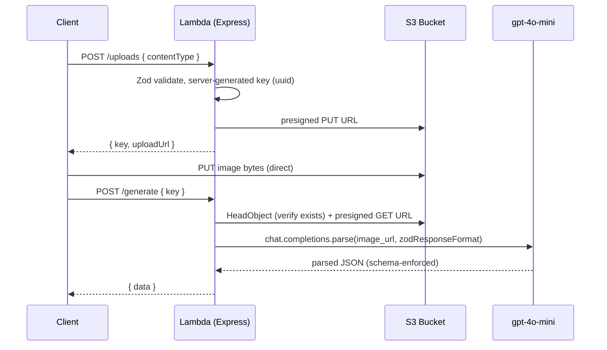

# SAM Express Vision API

A single AWS Lambda runs an Express app (via `@codegenie/serverless-express`) behind API Gateway. The client requests a presigned S3 PUT URL, uploads an image directly to S3, then asks the API to turn that image into structured JSON using `gpt-4o-mini` vision. Every boundary is validated with Zod.

## Architecture



## Two-step client flow

1. `POST /uploads` with `{ contentType }` (an allowlisted image MIME type). The server generates the S3 key and returns `{ key, uploadUrl }`.
2. Client `PUT`s the image bytes directly to S3 using `uploadUrl`.
3. `POST /generate` with `{ key }`. The server verifies the object exists, mints a presigned GET URL, calls `gpt-4o-mini`, and returns the validated JSON.

## Hard conventions (do not deviate)

- **Single Lambda, internal Express routing.** All routes live in one Express app on one Lambda. Do NOT create a separate Lambda per route. API Gateway proxies `ANY /{proxy+}` to the function.
- **Zod at every boundary.** Validate request bodies, the OpenAI response, and `process.env`. Never trust unvalidated input.
- **Server generates S3 keys.** Build the key as `uploads/${uuid}.${ext}`, where `ext` derives from the validated `contentType`. NEVER accept a client-supplied key for writes — it enables path traversal and overwrites.
- **Image reaches the model via presigned GET URL.** Pass the S3 presigned GET URL as `image_url` to `gpt-4o-mini`. NEVER download image bytes into the Lambda.
- **Structured output via the SDK helper.** Use `client.chat.completions.parse` with `zodResponseFormat(Schema, 'name')`. Read `completion.choices[0].message.parsed`.
- **Model from env.** Read the model from `OPENAI_MODEL` (default `gpt-4o-mini`). Do not hardcode the model string at call sites.
- **No `as` type assertions.** Use Zod-validated types or type guards. (Allowed: `as const`.)
- **Files under 500 lines.** Split by responsibility if a file grows past it.

## Target code shapes

Lambda handler (`src/lambda.ts`):

```ts
import serverlessExpress from '@codegenie/serverless-express';
import { app } from './app.js';

export const handler = serverlessExpress({ app });
```

OpenAI vision + structured output (`src/lib/openai.ts`):

```ts
import { zodResponseFormat } from 'openai/helpers/zod';
import { ExtractionSchema } from '../schemas.js';

const completion = await client.chat.completions.parse({
  model: env.OPENAI_MODEL,
  messages: [
    {
      role: 'user',
      content: [
        { type: 'text', text: 'Extract structured data from this image.' },
        { type: 'image_url', image_url: { url: imageUrl } },
      ],
    },
  ],
  response_format: zodResponseFormat(ExtractionSchema, 'extraction'),
});

return completion.choices[0].message.parsed;
```

## Verified dependencies

- `@codegenie/serverless-express` v5 — official Express-on-Lambda adapter, requires Node.js 24 ([npm](https://www.npmjs.com/package/@codegenie/serverless-express)).
- `openai` — `chat.completions.parse` + `zodResponseFormat` from `openai/helpers/zod`, supports `gpt-4o-mini` with `image_url` vision input ([helpers.md](https://github.com/openai/openai-node/blob/master/helpers.md)).
- `@aws-sdk/client-s3`, `@aws-sdk/s3-request-presigner` for S3 presigned URLs.
- `express`, `zod`.

## Environment variables

- `OPENAI_API_KEY` — required.
- `OPENAI_MODEL` — defaults to `gpt-4o-mini`.
- `UPLOAD_BUCKET` — S3 bucket name (injected by the SAM template at deploy).
