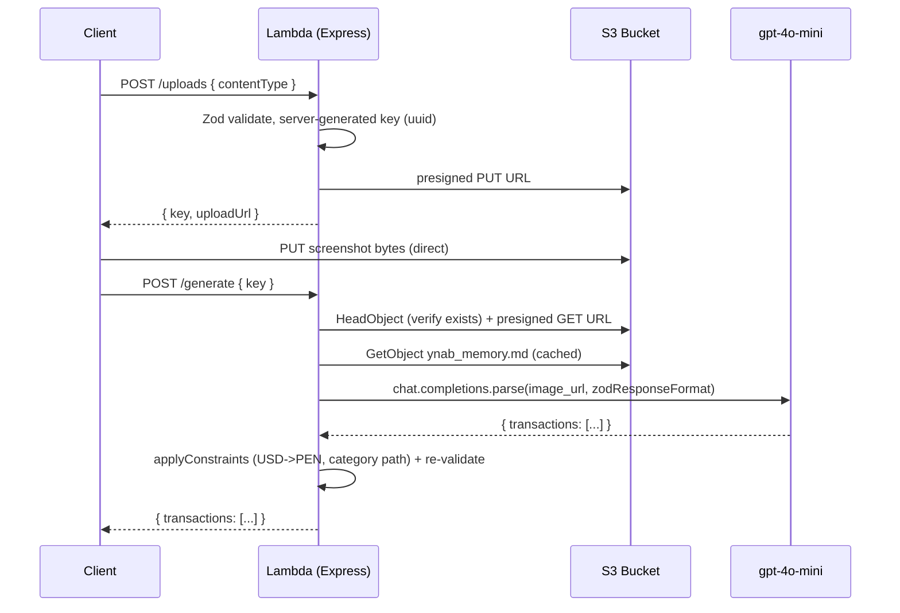

# SAM Express YNAB Extraction API

A single AWS Lambda runs an Express app (via `@codegenie/serverless-express`) behind API Gateway. The client requests a presigned S3 PUT URL, uploads a bank/app screenshot directly to S3, then asks the API to extract every YNAB transaction as structured JSON using `gpt-4o-mini` vision. Amounts are Peruvian soles (PEN); categories are constrained to an allowed list. Every boundary is validated with Zod.

## Architecture



## Two-step client flow

1. `POST /uploads` with `{ contentType }` (an allowlisted image MIME type). The server generates the S3 key and returns `{ key, uploadUrl }`.
2. Client `PUT`s the screenshot bytes directly to S3 using `uploadUrl`.
3. `POST /generate` with `{ key }`. The server verifies the object exists, loads the raw `ynab_memory.md` text from S3, mints a presigned GET URL, calls `gpt-4o-mini`, re-validates the result, and returns `{ transactions: [...] }`.

## Hard conventions (do not deviate)

- **Single Lambda, internal Express routing.** All routes live in one Express app on one Lambda. Do NOT create a separate Lambda per route. API Gateway proxies `ANY /{proxy+}` to the function.
- **Zod at every boundary.** Validate request bodies, the OpenAI response, and `process.env`. Re-validate the extracted transactions server-side before returning. Never trust unvalidated input.
- **Server generates S3 keys.** Build the key as `uploads/${uuid}.${ext}`, where `ext` derives from the validated `contentType`. NEVER accept a client-supplied key for writes — it enables path traversal and overwrites.
- **Image reaches the model via presigned GET URL.** Pass the S3 presigned GET URL as `image_url` to `gpt-4o-mini`. NEVER download image bytes into the Lambda.
- **Structured output via the SDK helper.** Use `client.chat.completions.parse` with `zodResponseFormat(Schema, 'name')`. Read `completion.choices[0].message.parsed`.
- **Model from env.** Read the model from `OPENAI_MODEL` (default `gpt-4o-mini`). Do not hardcode the model string at call sites.
- **Categories are constrained.** `category` is a full `Parent > Child` path from `src/categories.ts` (`ALLOWED_CATEGORIES`), the code-level source of truth. `ynab_memory.md` mirrors it.
- **Rules live in the prompt.** To add a domain rule: push a plain-text string to `PROMPT_RULES` in `src/constraints.ts`. The model applies all rules (including USD->PEN conversion). There is NO code-side post-processing pipeline.
- **Knowledge base in S3, inlined raw.** `ynab_memory.md` (allowed categories + payee history) is fetched from S3 and cached at runtime via `src/lib/memory.ts`, then injected into the system prompt as raw text (no parsing). Update it in S3 without redeploying.
- **Log token usage.** Each call logs `token_estimate` (local counts via `js-tiktoken`: memory + system prompt) and `token_usage` (API `prompt_tokens`/`completion_tokens`/`total_tokens`).
- **Auth: two tokens, two jobs.** The Cognito JWT (header) authenticates the client to the API; API Gateway's JWT authorizer validates it. The YNAB OAuth token (DynamoDB, keyed by the JWT `sub`/userId) authorizes the API to call YNAB and is never sent by the client. Extract `userId` only from the validated JWT via `src/auth.ts` (`getUserId()`); never trust a client-sent userId. Refresh YNAB tokens on expiry; keep the YNAB `client_secret` server-side. All routes need the JWT except `GET /health`.
- **No `as` type assertions.** Use Zod-validated types or type guards. (Allowed: `as const`.)
- **Files under 500 lines.** Split by responsibility if a file grows past it.

## Target code shapes

Lambda handler (`src/lambda.ts`) — `@codegenie/serverless-express` is CJS-only, so use the named `configure` export, not a default import:

```ts
import { configure } from '@codegenie/serverless-express';
import { app } from './app.js';

export const handler = configure({ app });
```

OpenAI vision + structured output (`src/lib/openai.ts`):

```ts
import { zodResponseFormat } from 'openai/helpers/zod';
import { TransactionsSchema } from '../schemas.js';

const completion = await client.chat.completions.parse({
  model: env.OPENAI_MODEL,
  messages: [
    { role: 'system', content: buildSystemPrompt(memory) },
    {
      role: 'user',
      content: [
        { type: 'text', text: 'Extract all transactions from this screenshot.' },
        { type: 'image_url', image_url: { url: imageUrl } },
      ],
    },
  ],
  response_format: zodResponseFormat(TransactionsSchema, 'transactions'),
});

return completion.choices[0].message.parsed;
```

Adding a constraint (`src/constraints.ts`) — just a prompt rule, no code pipeline:

```ts
export const PROMPT_RULES = [/* ...existing... */, 'New rule text the model should follow'];
```

Token logging (`src/lib/openai.ts`) via `js-tiktoken`:

```ts
import { countTokens } from './tokens.js';

console.log(JSON.stringify({
  event: 'token_estimate',
  memoryTokens: countTokens(memory),
  systemPromptTokens: countTokens(systemPrompt),
}));
// after the call, read completion.usage for actual prompt/completion/total tokens
```

## Verified dependencies

- `@codegenie/serverless-express` v5 — official Express-on-Lambda adapter, requires Node.js 24 ([npm](https://www.npmjs.com/package/@codegenie/serverless-express)).
- `openai` — `chat.completions.parse` + `zodResponseFormat` from `openai/helpers/zod`, supports `gpt-4o-mini` with `image_url` vision input ([helpers.md](https://github.com/openai/openai-node/blob/master/helpers.md)).
- `@aws-sdk/client-s3`, `@aws-sdk/s3-request-presigner` for S3 presigned URLs.
- `@aws-sdk/client-dynamodb`, `@aws-sdk/lib-dynamodb` for the per-user YNAB token store.
- `ynab` SDK for YNAB reads/writes (`.plans`, `.accounts`, `.categories`, `.transactions`); OAuth token exchange/refresh is a plain `fetch` to `https://app.ynab.com/oauth/token`.
- `js-tiktoken` — OpenAI-maintained pure-JS tokenizer for local token counting ([npm](https://www.npmjs.com/package/js-tiktoken)).
- `express`, `zod`.

## Environment variables

- `OPENAI_API_KEY` — required.
- `OPENAI_MODEL` — defaults to `gpt-4o-mini`.
- `UPLOAD_BUCKET` — S3 bucket name (injected by the SAM template at deploy).
- `USD_PEN_RATE` — USD->PEN exchange rate, defaults to `3.75`.
- `YNAB_MEMORY_KEY` — S3 key of the knowledge base file, defaults to `config/ynab_memory.md`.
