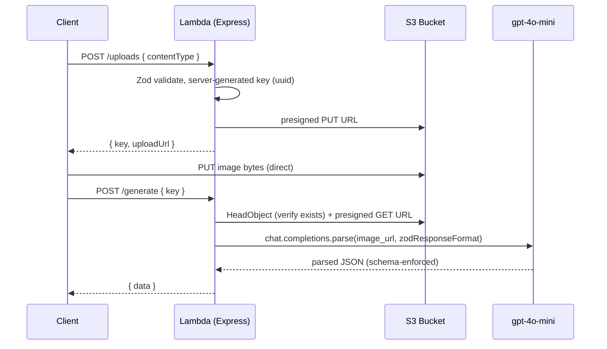

# AGENTS.md

## Overview

This project is an AWS SAM application: a single Lambda runs an Express app (via `@codegenie/serverless-express`) behind API Gateway. Clients request a presigned S3 PUT URL, upload an image directly to S3, then ask the API to convert that image into schema-validated JSON using `gpt-4o-mini` vision. All boundaries are validated with Zod. Written in strict TypeScript.

## Architecture



## Planned directory structure

```
.
├── template.yaml            # SAM: Node24 Express Lambda, HttpApi proxy, S3 bucket, IAM, outputs
├── package.json
├── tsconfig.json
├── eslint.config.js
├── .env.example
└── src/
    ├── app.ts               # Express app + routes + Zod error handler (no listen)
    ├── lambda.ts            # serverlessExpress({ app }) handler
    ├── local.ts             # app.listen(3000) for local dev
    ├── env.ts               # Zod-validated process.env loader
    ├── schemas.ts           # UploadRequestSchema, GenerateRequestSchema, ExtractionSchema
    ├── routes/
    │   ├── uploads.ts       # POST /uploads -> presigned PUT URL
    │   └── generate.ts      # POST /generate -> HeadObject + model call
    └── lib/
        ├── s3.ts            # presigned PUT/GET URLs, objectExists
        └── openai.ts        # gpt-4o-mini vision via chat.completions.parse
```

## Commands

| Command | Purpose |
|---------|---------|
| `npm run build` | Bundle TypeScript (esbuild via SAM) |
| `npm run dev` | Run Express locally (`src/local.ts`) |
| `sam local start-api` | Run the API via SAM locally |
| `npm run deploy` | `sam deploy --guided` |
| `npm run typecheck` | Strict TypeScript check |
| `npm run lint` | ESLint |

## Environment variables

| Variable | Required | Default | Notes |
|----------|----------|---------|-------|
| `OPENAI_API_KEY` | Yes | — | OpenAI API key |
| `OPENAI_MODEL` | No | `gpt-4o-mini` | Vision-capable model |
| `UPLOAD_BUCKET` | Yes | — | S3 bucket name, injected by SAM at deploy |

## Conventions

These are enforced by the project skill at `.cursor/skills/sam-express-vision/SKILL.md`. Read it before adding routes or touching S3/OpenAI code. Key rules:

- Single Lambda with internal Express routing — not one Lambda per route.
- Validate every boundary (request bodies, OpenAI response, env) with Zod.
- The server generates S3 keys; never trust a client-supplied key for writes.
- Pass images to `gpt-4o-mini` via a presigned GET URL (`image_url`); never download bytes into the Lambda.
- Structured output via `chat.completions.parse` + `zodResponseFormat`.
- No `as` type assertions; files under 500 lines.

Workspace-wide rules (strict TypeScript, no relative imports across folders, fix all lint/type errors before completing work) also apply.
