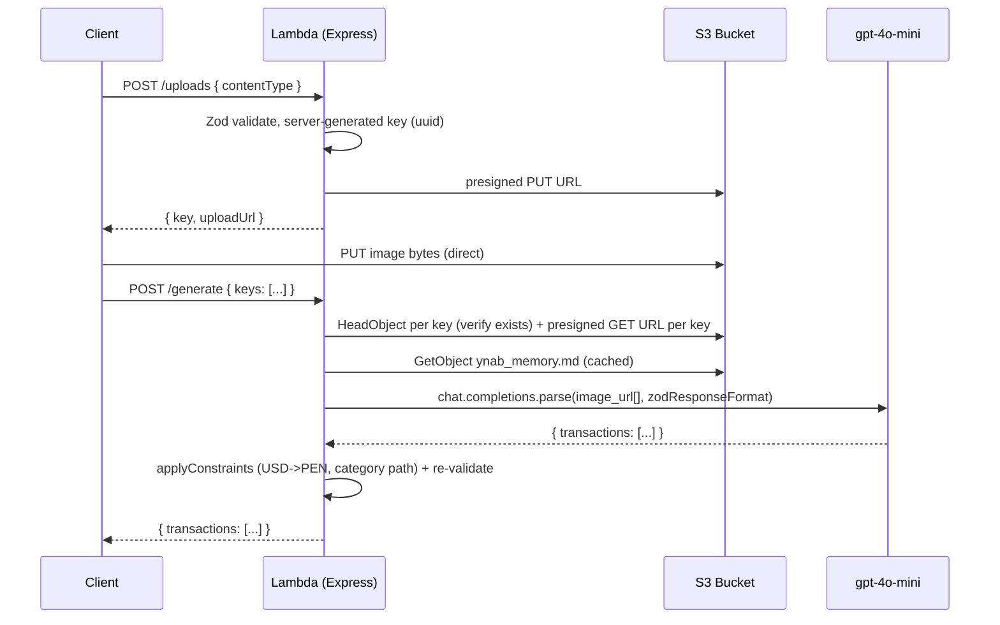

# AGENTS.md

## Overview

This project is an AWS SAM application that extracts YNAB transactions from a screenshot. A single Lambda runs an Express app (via `@codegenie/serverless-express`) behind API Gateway. Clients request a presigned S3 PUT URL, upload a bank/app screenshot directly to S3, then ask the API to extract every transaction as schema-validated JSON using `gpt-4o-mini` vision. Amounts are Peruvian soles (PEN); categories are constrained to an allowed list. All boundaries are validated with Zod. Written in strict TypeScript.

## Architecture



## Planned directory structure

```
.
├── template.yaml            # SAM: Lambda, explicit HttpApi + custom domain, ACM cert, S3 bucket, IAM, outputs
├── samconfig.toml           # Non-interactive deploy config (stack name, region, capabilities)
├── .github/workflows/
│   └── deploy.yml           # CI: deploy on push to main via OIDC
├── package.json
├── tsconfig.json
├── eslint.config.js
├── .env.example
├── ynab_memory.md           # Source of truth: allowed categories + payee history (upload to S3)
└── src/
    ├── app.ts               # Express app + routes + Zod error handler (no listen)
    ├── lambda.ts            # serverlessExpress({ app }) handler
    ├── local.ts             # app.listen(3000) for local dev
    ├── env.ts               # Zod-validated process.env loader
    ├── errors.ts            # HttpError (statusCode-carrying error)
    ├── auth.ts              # extract + Zod-validate userId from the Cognito JWT claims
    ├── categories.ts        # ALLOWED_CATEGORIES tuple (source of truth at code level)
    ├── schemas.ts           # request schemas + TransactionSchema/TransactionsSchema
    ├── constraints.ts       # PROMPT_RULES (plain-text rules injected into the prompt)
    ├── routes/
    │   ├── uploads.ts       # POST /uploads -> presigned PUT URL
    │   ├── generate.ts      # POST /generate -> extract + validate + { transactions }
    │   ├── ynab-auth.ts     # POST /auth/ynab/callback -> exchange + store YNAB tokens
    │   ├── ynab.ts          # GET /ynab/budgets, /ynab/budgets/:id/accounts
    │   └── push.ts          # POST /transactions/push -> create transactions in YNAB
    └── lib/
        ├── s3.ts            # presigned PUT/GET URLs, objectExists, getObjectText
        ├── memory.ts        # fetch + cache raw ynab_memory.md text from S3
        ├── tokens.ts        # countTokens helper (js-tiktoken)
        ├── tokens-store.ts  # DynamoDB get/put YNAB tokens keyed by userId
        ├── ynab.ts          # YNAB OAuth exchange/refresh + budgets/accounts/push
        ├── ynab-mapping.ts  # Transaction -> YNAB NewTransaction (milliunits, sign, category)
        └── openai.ts        # gpt-4o-mini vision via chat.completions.parse + token logging
```

## Commands

| Command | Purpose |
|---------|---------|
| `npm run build` | Bundle TypeScript (esbuild via SAM) |
| `npm run dev` | Run Express locally (`src/local.ts`) |
| `sam local start-api` | Run the API via SAM locally |
| `npm run deploy` | `sam deploy --guided` |
| `npm run typecheck` | Strict TypeScript check |
| `npm run lint` | ESLint |

## Environment variables

| Variable | Required | Default | Notes |
|----------|----------|---------|-------|
| `OPENAI_API_KEY` | Yes | — | From SSM String `/ynab/openai-api-key` (via `{{resolve:ssm:...:1}}`) |
| `OPENAI_MODEL` | No | `gpt-4o-mini` | Vision-capable model |
| `UPLOAD_BUCKET` | Yes | — | S3 bucket name, injected by SAM at deploy |
| `USD_PEN_RATE` | No | `3.75` | Exchange rate for USD->PEN conversion |
| `YNAB_MEMORY_KEY` | No | `config/ynab_memory.md` | S3 key of the knowledge base file |

## Deployment

- Stack name `ynabagent-api`, region `us-east-1` ([samconfig.toml](samconfig.toml)).
- Custom domain `api.ynabagent.josnavdev.lat` is SAM-managed: an in-stack ACM certificate (DNS-validated via the Route53 hosted zone), an explicit `AWS::Serverless::HttpApi` with a `Domain` block, and an auto-created Route53 alias + base-path mapping.
- Deploy-time config is resolved from SSM Parameter Store: `HostedZoneId` from `/ynab/hosted-zone-id` (via an `AWS::SSM::Parameter::Value<String>` parameter), the OpenAI key from `/ynab/openai-api-key`, and the YNAB OAuth client id/secret from `/ynab/oauth-client-id` and `/ynab/oauth-client-secret` (all plain Strings, via `{{resolve:ssm:...:1}}`). No secrets in the template or CI.
- CI: pushing to `main` runs [.github/workflows/deploy.yml](.github/workflows/deploy.yml), authenticating to AWS via OIDC (`AWS_DEPLOY_ROLE_ARN`/`AWS_REGION` repo variables, no stored keys), then `sam build` + `sam deploy`.

## Authentication

- **Two tokens, two jobs.** The **Cognito JWT** authenticates the client to the API (sent in the `Authorization` header; validated by the API Gateway JWT authorizer; `sub` claim = `userId`). The **YNAB OAuth token** authorizes the API to act on YNAB and is never sent by the client.
- Cognito User Pool is admin-create-only (no public sign-up). Client logs in with `USER_PASSWORD_AUTH` (public client, no secret).
- All routes require the JWT except `GET /health` (explicitly `Auth: { Authorizer: NONE }`).
- YNAB OAuth tokens are stored in DynamoDB keyed by the Cognito `userId` (`src/lib/tokens-store.ts`), and refreshed automatically when the 2-hour access token expires (`src/lib/ynab.ts`). The YNAB `client_secret` is used only server-side in the token exchange/refresh.

## Conventions

These are enforced by the project skill at `.cursor/skills/sam-express-vision/SKILL.md`. Read it before adding routes or touching S3/OpenAI code. Key rules:

- Single Lambda with internal Express routing — not one Lambda per route.
- Validate every boundary (request bodies, OpenAI response, env) with Zod, and re-validate the extracted transactions server-side before returning.
- The server generates S3 keys; never trust a client-supplied key for writes.
- Pass images to `gpt-4o-mini` via a presigned GET URL (`image_url`), one content part per image; `/generate` accepts multiple keys and sends all images in one request. Never download bytes into the Lambda.
- Structured output via `chat.completions.parse` + `zodResponseFormat`.
- `category` must be a full `Parent > Child` path from `src/categories.ts`; this is the code-level source of truth and `ynab_memory.md` mirrors it.
- Extend domain rules in `src/constraints.ts`: add a string to `PROMPT_RULES`. The model applies all rules (including USD->PEN conversion); there is no code-side post-processing pipeline.
- The knowledge base (`ynab_memory.md`) lives in S3, is fetched + cached at runtime, and is injected into the system prompt as raw text (no parsing). Update it in S3 without redeploying.
- Token usage is logged per call: `token_estimate` (local memory + system-prompt token counts via `js-tiktoken`) and `token_usage` (actual API `prompt_tokens`/`completion_tokens`/`total_tokens`).
- Extract `userId` from the validated JWT (`src/auth.ts`); NEVER trust a client-sent userId. YNAB tokens are keyed by it in DynamoDB and refreshed on expiry. The YNAB `client_secret` stays server-side.
- No `as` type assertions; files under 500 lines.

Workspace-wide rules (strict TypeScript, no relative imports across folders, fix all lint/type errors before completing work) also apply.
